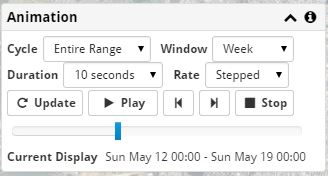

Map Animation
-------------

Data on the map can be animated to show how it varies over time using the **Animation** panel.

Cycle Duration
++++++++++++++

The animation is used to show how the data plotted on the map varies over time.  If **Cycle** is set to *Entire Range*, the animation will span the duration of all of the data that is plotted on the map.  If *Week* or *Day* is selected, the data on the map is aggregated to that time period, and the animation is for that duration.

For example, if data from the whole year is loaded, and if **Cycle** is set to *Week*, then the animation will group together the data based on weeks.  Therefore, if the **Window** is set to *Day*, the first frame of the animation will show all the data from Sunday, regardless of when in the year that Sunday occurred.  The second frame would show Monday, and so on.  Thus, each animation frame on the map includes data from the whole year, but only from a selected part of the specified Cycle.

Data Window
+++++++++++

The **Window** control specifies how much data is shown at a time.  The selected **Cycle** is divided into frames of data based on this window.

For example, a window of one hour will show one hour of data at time.  In a stepped animation, each step of the animation is a different hour.  If a smooth (non-stepped) animation, each frame of the animation will still consist of exactly an hour, but it is a sliding time period.  One frame may span 1:00 - 2:00, and the next from 1:15 - 2:15 (depending on the animation rate).

Duration and Rate
+++++++++++++++++

The **Duration** is how long a complete animation cycle will take.  Longer slows down the animation.  This only affects how quickly the animation plays, not what is animated.

If the **Rate** is stepped, each frame of the animation consists of data not visible in the other frames.  If it is a non-stepped, intermediate frames may be shown if necessary to try to reach the specified frame rate.

If your hardware cannot support the requested frame rate, some frames will be skipped.

Controls
++++++++

In addition to the usual play, pause, and stop controls, you can drag the slider to select a particular animation frame.
