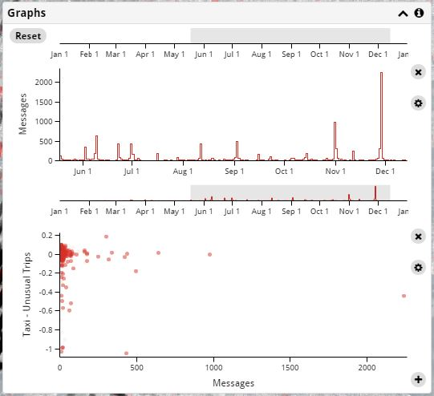
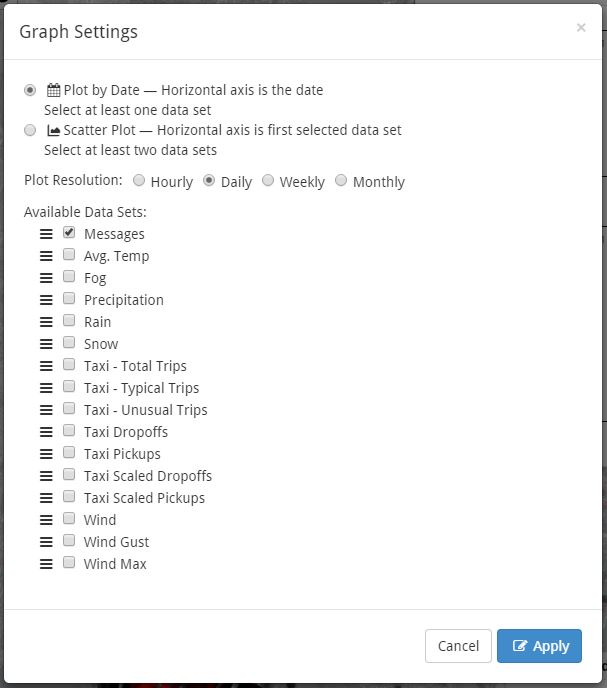

Graphs
-----------------------------

Data and be graphed or further filtered by date using the **Graphs** panel.

Selecting a Date Range
++++++++++++++++++++++

The Graphs panel always shows a date range selector at the top.  You can select a date range by dragging drag a horizontal range with the mouse.  The mouse wheel or a zoom gesture increases or decreases the date range.  The **Reset** button clears the date range selection and shows the entire range.

When a date range is selected, only the restricted data is shown on the map, in the Instagram and Twitter Results panel, and on the graphs.  Animations will only use the restricted data.  Scatter-plot graphs dim data that is outside of the selected date range.

Creating and Deleting Graphs
++++++++++++++++++++++++++++

To create a new graph, select the **+** control at the bottom right of the Graph panel.  A default graph is created that can be modified using the settings control (see below).

If any Instagram or Twitter messages have been selected with the filters, the default graph shows the daily number of messages based on the filter.  If no messages are selected, the default graph shows the daily mean temperature.

To delete a graph, select the **x** control next to the graph.

Graph Settings
++++++++++++++

Graphs are changed by selecting the Settings control (the gear) next to the right of the graph.

There are two basic types of graphs:

- **Plot by Date** shows a stepped line graph.  The x-axis is the date, and all of the selected data sets are plotted vertically.

- **Scatter Plot** plots one or more data sets with respect to another.  The x-axis is the first selected data set, and all other data sets are plotted vertically.

The **Plot Resolution** determines how the data is aggregated for the graph.  Some trends are easier to see when binned into different time periods.  If *hourly* is selected, the graphs may be slow to respond.

The **Available Data Sets** list all of the different values that be be plotted on the graphs.  The order of the data sets can be altered by dragging them.  Any data set that is checked will be plotted on the graph.  For *Scatter Plots*, the first data set that is selected will be on the horizontal scale, and all others are on the vertical scale.

Data Sets
+++++++++

Taxi Data
=========

This data is based on the taxi trips that were selected using the Filter panel.

- **Taxi Pickups** are the number of filtered taxi pickups for each time period.

- **Taxi Dropoffs** are the number of filtered taxi pickups for each time period.

- **Taxi Scaled Pickups** are the filtered taxi pickups for each time period converted to the same log scale as used by the Taxi Statistical Trend data.  The tally values are scaled if not all of the filtered data was loaded (if increasing Max Trips on the Filter panel would have loaded more data).

- **Taxi Scaled Dropoffs** are the filtered taxi dropoffs for each time period converted to the same log scale as used by the Taxi Statistical Trend data.  The values are scaled if not all of the filtered data was loaded.

Instagram and Twitter Data
==========================

This data is based on the Instagram and Twitter messages that were selected using the Filter panel.

- **Messages** are number of filtered Instagram and Twitter messages for each time period.

Taxi Statistical Trends
=======================

An STL analysis was performed on the yellow cab taxi pickups, determining the usual trip activity using a weekly cycle and taking into account an overall trend.  This analysis was done on the log:subscript:`2` value of the hourly trips.  If the graph is shown for a *plot resolution* other than hourly, the results are converted to that resolution as needed.

- **Taxi - Total Trips** show the log:subscript:`2` number of trips used for the STL analysis.

- **Taxi - Typical Trips** show the log:subscript:`2` number of trips that are considered normal based on the overall trend and seasonal (weekly) variations.

- **Taxi - Unusual Trips** show the difference in the log:subscript:`2` scale of the actual trips that were taken and the values that were predicted based on trend and seasonal variations.  Values that are far from 0 indicate unusual activity.

Weather
=======

The weather data is from daily values collected in Central Park.

The values for **Rain**, **Snow**, and **Fog** are based on a textual "events" record and are either 0 if the event did not occur or 1 if it did.  If the *plot resolution* is longer than a day, these events are tallied for that duration.
