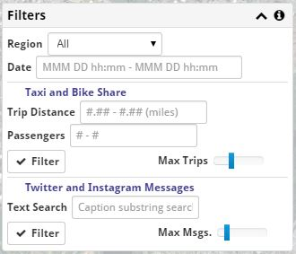
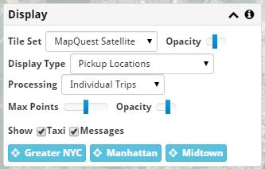

GeoApp: Data Analysis Tool
==========================

Data Sources
------------

GeoApp provides a way to examine two data sets from 2013 concentrated in New
York City.  The two data sets are:

* **Taxicab Trips**
    This includes all yellow cab trips in Mahattan and some of the green cab
    trips from the nearby area.  The data includes pickup and dropoff locations
    and time, plus a variety of other data.  Around 173 million trips are in
    the database.

* **Instagram Messages**
    This is a subset of Instagram messages that were in the greater New York
    area.  Around 7.5 million messages are in the database.

* **Twitter Messages**
    This is a subset of Twitter messages that were in the greater New York
    area.  Around 12.5 million messages are in the database.

There is some additional data that can be plotted on graphs, but not on the map:

* **Central Park Weather**
      There is daily information on temperature, wind, precipitation and other values.
  
* **Taxi Statistical Trends**
    The taxi activity was processed usign a statistical modelling package to determine what conisted of routine activity and what was unusual activity.

Selecting Data (Filtering)
--------------------------

Data is selected in the **Filters** panel.

Taxi Data
+++++++++

If you select the upper **Filter** button, taxi trip information is loaded from the database.  By default, a limited sample of data is loaded, distributed across the entire year of 2013.

The **Max Trips** slider can be used to load more data, which will result in more accurate graphs and binned data, but take longer and use more local resources.

The **Pickup Date** can be specified to limit which trips are loaded.  Remember that the data is only for 2013, so if you specify a date outside of that range, you won't get any results.  The date range is *inclusive* of the start and *exclusive* of the end.  For instance, to load the day of May, specify from 2013-05-01 00:00 - 2013-05-02 00:00.  Times are 24 hour format.

Taxi data is plotted on the map using black points for each trip, or shown using blue and yellow points, lines, or squares, depending on the display settings.

Instagram and Twitter Data
++++++++++++++++++++++++++

The lower **Filter** button loads Instagram and Twitter messages from the database.  If **Use Pickup Date Range** is selected, the Pickup Date from the Taxi area will be used.  If it is not selected, the dates can be limited by specifying a range in the **Posted Date** field.

The **Max Inst.** slider can be usd to load more data, which will take longer and use more local resources.

A **Caption Search** can be used to get only messages related to a particular topic.  This uses a general text search, so a value of 'Hospital' will match both 'Hospital' and 'Hospitality'.  If multiple words are specified, all words are required.  Words can be prefixed with a minus sign to exclude them, and can be quoted to match an exact form.  For instance, 'Hospital -"Hospitality"' will find hospitals but exclude posts about hotel conferences.

Instagram and Twitter data is plotted on the map using red points.

Displaying Data
---------------

Background Map
++++++++++++++

The base map can be changed using the **Tile Set** option in the **Display** panel.  It can be made more or less visible with the **Opacity** slider next to the Tile Set Option.

A specific area of the map can be centered by selecting one of the location buttons (**Manhattan**, **Midtown**, or **Times Sq.**).

The map can be panned and zoomed with the mouse.

Taxi Data
+++++++++

The taxi data contains pickup and dropoff locations and times for each trip.  If **Processing** is set to 'Individual Trips', each trip that was filtered will be shown as a single dot.  If the **Display Type** is 'Pickup Locations', the points are drawn in black and show where taxis picked up fares.  'Dropoff Locations' show black points where the fares were discharged.  'Pickup - Dropoff Locations' show pickups in *blue* and dropoffs in *yellow*.

The **Max Points** control determine how much is drawn on the map.  You can load more points with the filtering options than your machine might display easily.  The **Opacity** control determines how dark each point appears.

If **Display Type** is 'Pickup - Dropoff Vectors' a straight line connects each pickup location with the corresponding dropoff location.  The line is blue at the pickup end and yellow at the dropoff end.

If **Processing** is set to 'Binned Heatmap', all of the filtered taxi trips are used to produce a a grid of squares whose opacity is proportional to whichever square had the most taxi trips.  If the **Display Type** is 'Pickup - Dropoff Locations', the squares are blue when there are more pickups than dropoffs, and yellow when there are more dropoffs than pickups.  The number of bins across the map can be changed and the map can be rebinned as desired.

Instagram and Twitter Data
++++++++++++++++++++++++++

Instagram and Twitter data is always shown as red points.  The **Max Points** and **Opacity** controls affect how it is displayed.

Animation
---------

TODO

Instagram Results
-----------------

TODO

Graphs
------

TODO
