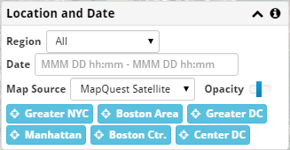

Location and Date
-----------------

The overall data region and time is selected in the **Location and Date** panel.

Region and Date
+++++++++++++++

The **Region** control restricts results to a specific city or selects data
from all regions.  After changing this, you need to select **Filter** for both
the trip and message data to reload it with the changed region.

The **Date** can be specified to limit which trips and messages re loaded.  The date range is *inclusive* of the start and *exclusive* of the end.  For instance, to load the first day of May, specify from 2013-05-01 00:00 - 2013-05-02 00:00.  Times are 24 hour format.

Background Map
++++++++++++++

The base map can be changed using the **Map Source** option in the **Display** panel.  It can be made more or less visible with the **Opacity** slider next to the Map Source Option.

A specific area of the map can be centered by selecting one of the location buttons (**Manhattan**, for example).

The map can be panned and zoomed with the mouse or using touch gestures.
