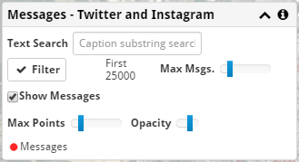

Message Data
------------

Twitter and Instagram Data
++++++++++++++++++++++++++

The **Filter** button loads Instagram and Twitter messages from the database.

The **Max Msgs.** slider can be used to load more data, which will take longer and use more local resources.  When more data is loaded some of the graphs will be more accurate.

A **Text Search** can be used to get only messages related to a particular topic.  This uses a general text search, so a value of 'Hospital' will match both 'Hospital' and 'Hospitality'.  If multiple words are specified, all words are required.  Words can be prefixed with a minus sign to exclude them, and can be quoted to match an exact form.  For instance, 'Hospital -"Hospitality"' will find hospitals but exclude posts about hotel conferences.

You can use the | character to perform OR searches, ! or - excludes a serach term.  Parentheses ( ) can be used to group terms for more complicated searches.

Data Display
++++++++++++

**Show Messages** can be used to hide all message information from the map.  It does not affect the results or graph panels.

The **Max Points** control determine how much is drawn on the map.  You can load more points with the filtering options than your machine might display easily.  The **Opacity** control determines how dark each point appears.

Instagram and Twitter data is plotted on the map using red points.

A legend is shown based on the current display settings.
