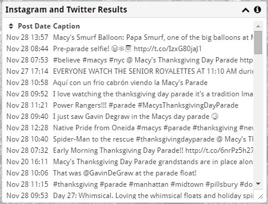
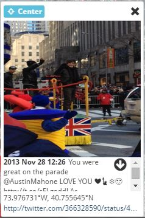

Instagram and Twitter Results
-----------------------------

Instagram and Twitter messages are loaded by using the :ref:`Filters <filterMessages>` panel.  You can filter messages by date or by a caption search.

A list of the filtered messages are shown in the **Instagram and Twitter Results** panel.

Sorting
+++++++

If you select the arrow to the left of *Post Date*, the results will toggle between sorted by date ascending, sorted by date descending, and unsorted.

Listing More Messages
+++++++++++++++++++++

Only the first hundred messages are initially loaded into the scrolling list.  If you scroll to the bottom of the list, more messages will be loaded.  This continues until all messages are loaded.

Overlays
++++++++

If you *hover* over a message point on the map or over a message in the results list, an overlay will appear showing the message, its location, and a link to Instagram or Twitter.  If an image is avaialble from Instagram or Twitter, an image is loaded as well.

Sometimes, no image is available because it was deleted from the host service or because the host service fails to return an image in a timely manner.

If you *click* on a message point or a message in the results list, the overlay will "stick", and not vanish when you move the mouse.  You can dismiss the overlay by clicking anywhere outside of the overlay or on the close button in the upper right corner.  If you click **Center**, the map will be panned until the geo-reference of the point is centered on the display.

If the message is located off of the visible area of the map, a circle with an arrow in it will point in the direction that the message originated from.
