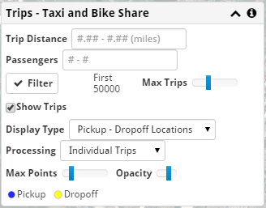

Trip Data
---------

Taxi and Bike Share Data
++++++++++++++++++++++++

If you select the **Filter** button, taxi and bike share trip information is loaded from the database.  By default, a limited sample of data is loaded, distributed across the selected date range and region.

The **Max Trips** slider can be used to load more data, which will result in more accurate graphs and binned data, but take longer and use more local resources.

Trips can be selected based on **Trip Distance** and number of **Passengers**.  Not all data sets have this information (for instance, it isn't set in the Bike Share data).

Trip data is plotted on the map using black points for each trip, or shown using blue and yellow points, lines, or squares, depending on the display settings.

Data Display
++++++++++++

**Show Trips** can be used to hide all trip information from the map.

The taxi data contains pickup and dropoff locations and times for each trip.  If **Processing** is set to 'Individual Trips', each trip that was filtered will be shown as a single dot.  If the **Display Type** is 'Pickup Locations', the points are drawn in black and show where taxis picked up fares.  'Dropoff Locations' show black points where the fares were discharged.  'Pickup - Dropoff Locations' show pickups in *blue* and dropoffs in *yellow*.

The **Max Points** control determine how much is drawn on the map.  You can load more points with the filtering options than your machine might display easily.  The **Opacity** control determines how dark each point appears.

If **Display Type** is 'Pickup - Dropoff Vectors' a straight line connects each pickup location with the corresponding dropoff location.  The line is blue at the pickup end and yellow at the dropoff end.

If **Processing** is set to 'Binned Heatmap', all of the filtered taxi trips are used to produce a a grid of squares whose opacity is proportional to whichever square had the most taxi trips.  If the **Display Type** is 'Pickup - Dropoff Locations', the squares are blue when there are more pickups than dropoffs, and yellow when there are more dropoffs than pickups.  The number of bins across the map can be changed.  The data is rebinned whenever the map is panned or zoomed.

A legend is shown based on the current display settings.
